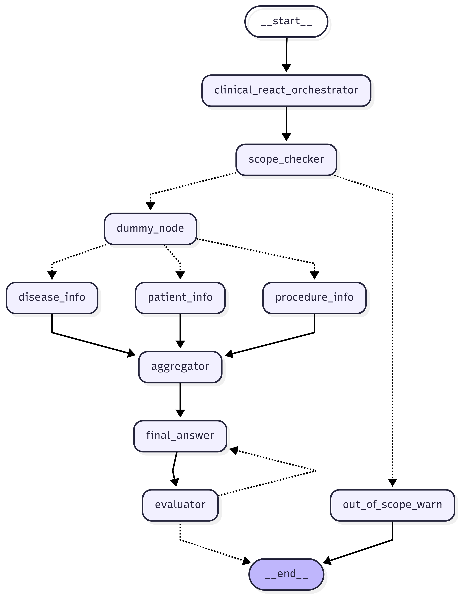

# Medical AI Assistant

This project is a Medical AI Assistant designed to provide comprehensive responses to user queries by integrating information from multiple sources:

- **Internal Medical Procedures:** Stored in a vector database (MongoDB Atlas).
- **Patient Data:** Stored in a SQL database (MySQL).
- **Disease Information:** Provided by a fine-tuned LLM (based on llama-3.2-3b-instruct-unsloth-bnb-4bit).

The agent can:
- Answer questions about internal medical procedures.
- Retrieve and utilize patient data.
- Provide disease-related information.
- Combine information from all sources to answer complex user requests within its capabilities.

<p align="center">
	
</p>

## Architecture

The project is built around a **Workflow Parallelization** approach, enabling the agent to efficiently identify and retrieve all required information in parallel. The main architectural components are:

- **Input Normalization Node:** The first step in the workflow is a node that normalizes and interprets the user's input. This node determines which types of data are needed to answer the query (e.g., patient info, medical procedure data, cancer/disease information).

- **Parallel Data Retrieval:** Once the required data types are identified, the workflow launches parallel nodes to retrieve:
	- Patient information (from MySQL)
	- Medical procedure data (from MongoDB Atlas vector search)
	- Cancer/disease information (from the fine-tuned LLM)

- **Evaluator-Optimizer Node:** After data is gathered, an evaluator-optimizer node ensures that the final response only suggests possible actions or information, never making direct medical decisions or prescriptions. This node reviews and optimizes the output for safety and compliance.

- **Orchestrator-Worker Pattern:** The overall workflow is managed using the orchestrator-worker pattern, with LangGraph handling orchestration and workflow logic.

- **Ollama:** Used for LLM inference and management.

- **LM Studio:** Used for Fine Tunned LLM inference and management.

- **Docker Compose:** For containerized deployment and service management.


## Data Sources

- **Vector Database:** MongoDB Atlas for storing and retrieving medical procedure information using vector search.
- **SQL Database:** MySQL for structured patient data.
- **LLM:** Fine-tuned llama-3.2-3b-instruct-unsloth-bnb-4bit model for disease information and natural language understanding.


## Capabilities

- Intelligent routing and orchestration of user requests.
- Multi-source data integration for comprehensive answers.
- Secure handling of patient and medical data.

## Requirements

- Docker & Docker Compose
- Access to MongoDB Atlas and MySQL
- Ollama for LLM management
- LM Studio

## Getting Started

1. **Clone the repository**
2. **Configure environment variables** for database and LLM access.
3. **Start services** using Docker Compose.
4. **Interact with the agent** via the provided API or interface.

### Required Models

The following models are required to run the agent:

- **ollama/llama3.1:8b** — Used for general agent nodes (LLM)
- **Groff/tech3_model.gguf** — Fine-tuned for disease information (must be run in LM Studio)
- **ollama/llama3** — Used for embeddings

#### Downloading Models with Ollama

To download the required models for Ollama, run:

```bash
ollama pull llama3.1:8b
ollama pull llama3
```

#### Running the Fine-Tuned Model

The model [`Groff/tech3_model.gguf`](https://huggingface.co/Groff/tech3_model.gguf) is a fine-tuned LLM for disease information. You must run this model using [LM Studio](https://lmstudio.ai/) and ensure it is accessible to the agent.

## Building and Running the Project

### 0.1. Load Medical Procedure Embeddings into MongoDB Atlas

Before running the agent, you must load the MongoDB Atlas database with medical procedure embeddings. Run the following command in the project root:

```bash
python mongodb_pdf_loader.py
```

This will process the medical procedure PDF and upload the embeddings to your MongoDB Atlas instance.

Copy the example environment file and rename it:

```bash
cp .env.example .env
```

Edit the new `.env` file and fill in the value for `LANGSMITH_API_KEY` with your valid LangSmith API key.

### 1. Build the LangGraph Agent Docker Image

In the root folder, run:

```bash
langgraph build --tag medical-agent:v1.0.0
```

### 2. Start All Services

Start the agent, databases, and LLM using Docker Compose:

```bash
docker compose up
```

### 3. Connect via LangSmith

Access LangSmith and connect to the LangGraph server running locally at port **8123**.

## Running Locally

To run this project locally (outside Docker), you need to have [uv](https://github.com/astral-sh/uv) installed.

1. Install dependencies:

	```bash
	uv sync
	```

2. Start the development server:

	```bash
	uv run langgraph dev
	```

This will launch the agent locally for development and testing.

## Fine-Tuning the Model

To fine-tune the disease information model yourself, follow the detailed instructions in [fine_tuned_model/README.md](fine_tuned_model/README.md). This guide covers:

- Preparing and converting the MedQuAD dataset
- Generating training data
- Running the fine-tuning process with Unsloth
- Merging LoRA adapters and exporting to GGUF format

Refer to that file for step-by-step commands and requirements.

